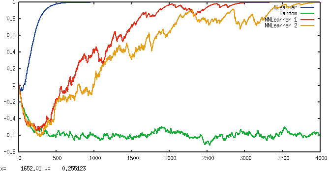

# Reinforcement Learning: An Introduction

Implementing exercises for [Reinforcement Learning: An Introduction](http://webdocs.cs.ualberta.ca/~sutton/book/the-book.html).

## Chapter 2 - Bandit Problems

`nbandit.py`, implementation of a greedy and epsilon greedy agent for the n-armed bandit problem. For explanations on how it works, read the book ;)

## Playing Catch

As a more interesting test, I next tried my hand at a very simple game: Catch. 

A ball starts at a random position at the top of a 5x5 playing field and moves down one row each round. The player controls a bat to catch the ball width, which can either move left, right or stand still. Catching the ball gives a reward of +1, missing -1.

A naive table based agent learns to play perfectly after ~500 episodes, the neural network based ones (with 1 and 2 hidden layers) take quite a bit longer, about 3000 episodes:

