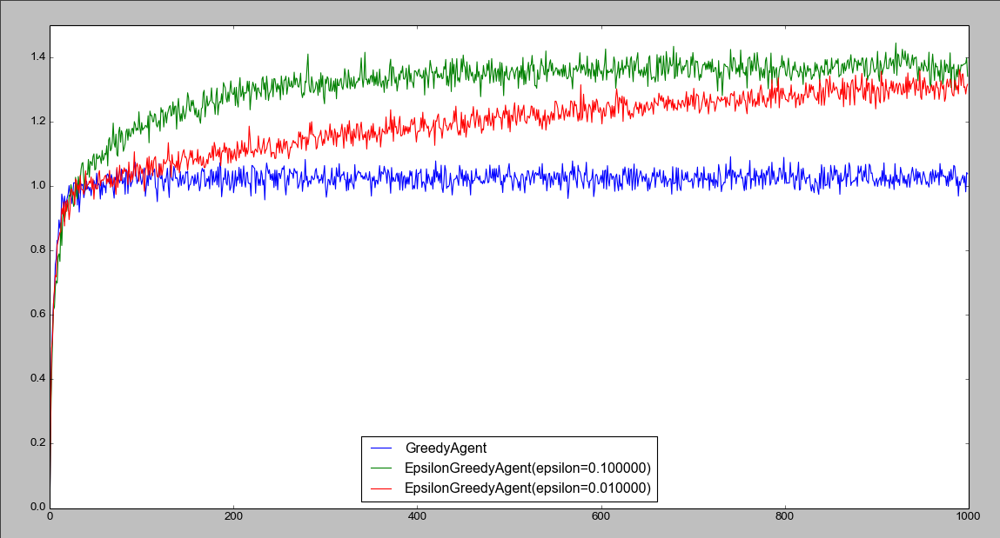

# Reinforcement Learning: An Introduction

Implementing exercises for [Reinforcement Learning: An Introduction](http://webdocs.cs.ualberta.ca/~sutton/book/the-book.html).

## Chapter 2 - Bandit Problems

`nbandit.py`, implementation of a greedy and epsilon greedy agent for the n-armed bandit problem. For explanations on how it works, read the book ;)
